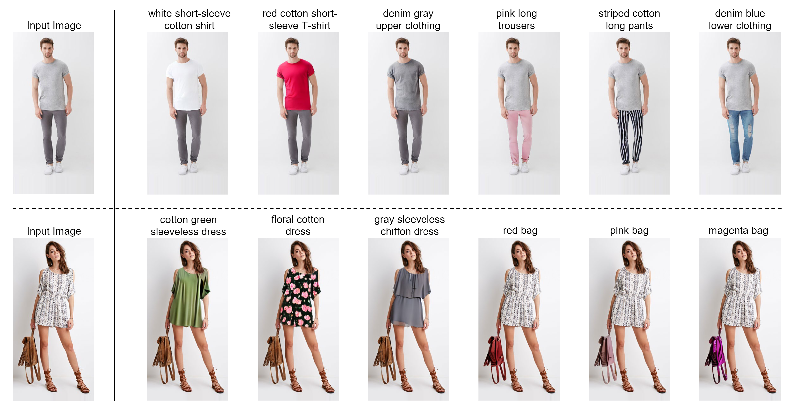

# TexFit: Text-Driven Fashion Image Editing with Diffusion Models


### TexFit: Text-Driven Fashion Image Editing with Diffusion Models (AAAI 2024)
<div align="justify">
<b>Abstract</b>: Fashion image editing aims to edit an input image to obtain richer or distinct visual clothing matching effects. Existing global fashion image editing methods are difficult to achieve rich outfit combination effects while local fashion image editing is more in line with the needs of diverse and personalized outfit matching. The local editing techniques typically depend on text and auxiliary modalities (e.g., human poses, human keypoints, garment sketches, etc.) for image manipulation, where the auxiliary modalities essentially assist in locating the editing region. Since these auxiliary modalities usually involve additional efforts in practical application scenarios, text-driven fashion image editing shows high flexibility. In this paper, we propose TexFit, a <b>Tex</b>t-driven <b>F</b>ashion <b>i</b>mage Edi<b>t</b>ing method using diffusion models, which performs the local image editing only with the easily accessible text. Our approach employs a text-based editing region location module to predict precise editing region in the fashion image. Then, we take the predicted region as the generation condition of diffusion models together with the text prompt to achieve precise local editing of fashion images while keeping the rest part intact. In addition, previous fashion datasets usually focus on global description, lacking local descriptive information that can guide the precise local editing. Therefore, we develop a new DFMM-Spotlight dataset by using region extraction and attribute combination strategies. It focuses locally on clothes and accessories, enabling local editing with text input. Experimental results on the DFMM-Spotlight dataset demonstrate the effectiveness of our model.
</div>

### Setup

Initialize a [conda](https://docs.conda.io/en/latest) environment named texfit by running:
```shell
conda env create -f environment.yaml
conda activate texfit

# install mmcv and mmsegmentation
pip install -U openmim
mim install mmcv==1.2.1
mim install mmsegmentation==0.9.0
```

And then initialize an [🤗Accelerate](https://github.com/huggingface/accelerate/) environment with:

```shell
accelerate config
```

### Data Preparation

You need to download DFMM-Spotlight dataset from [Google Drive](https://drive.google.com/file/d/1AJBWrOENyssJX1zK6VtbT-mMC8_xXbR_/view?usp=sharing) and unzip to your own path `/path/to/DFMM-Spotlight`. The dataset folder structure should be as follows:

```
DFMM-Spotlight
├── train_images
│   ├── MEN-Denim-id_00000080-01_7_additional.png
│   ├── .......
│   └── WOMEN-Tees_Tanks-id_00007979-04_4_full.png
├── test_images
│   ├── MEN-Denim-id_00000089-03_7_additional.png
│   ├── .......
│   └── WOMEN-Tees_Tanks-id_00007970-01_7_additional.png
├── mask
│   ├── MEN-Denim-id_00000080-01_7_additional_mask_0.png
│   ├── .......
│   └── WOMEN-Tees_Tanks-id_00007979-04_4_full_mask_0.png
└── mask_ann
    ├── train_ann_file.jsonl
    └── test_ann_file.jsonl
```

### Training and Inference

**___Important note: Replace all the `/path/to` paths in the code and configuration files with real paths.___**

**___`/path/to` paths exist in all the configuration files under the folder `configs` and `dataset/dfmm_spotlight_hf/dfmm_spotlight_hf.py`.___**

#### Train the ERLM (Stage I)

Train the editing region location module ERLM with the following command:

```shell
CUDA_VISIBLE_DEVICES=0 python train_erlm.py --opt ./configs/region_gen.yml
```

#### Train the TexFit (Stage II)

Train the local fashion image editing model TexFit with the following command:

```shell
bash train_texfit.sh
```

#### Local Fashion Image Editing

Once the ERLM and Texfit are trained, you can edit a fashion image locally by running the following command:

```shell
CUDA_VISIBLE_DEVICES=0 python pipeline.py \
  --opt ./configs/region_gen.yml \
  --img_path /path/to/your_fashion_image_path \
  --output_path /path/to/edited_image_saving_path \
  --text_prompt the_editing_text_prompt \
  --erlm_model_path /path/to/trained_erlm_model_path \
  --texfit_model_path /path/to/trained_texfit_model_path
```

For example:

```shell
CUDA_VISIBLE_DEVICES=0 python pipeline.py \
  --opt ./configs/region_gen.yml \
  --img_path examples/MEN-Denim-id_00000089-03_7_additional.png \
  --output_path ./example_output.png \
  --text_prompt 'denim blue lower clothing'  \
  --erlm_model_path experiments/region_gen/models/region_generation_epoch55.pth \
  --texfit_model_path sd-model-finetuned/texfit-model
```

### Citation

If you find this paper or the code useful for your research, please consider citing:

```bibtex
@inproceedings{wang2024texfit,
  title={TexFit: Text-Driven Fashion Image Editing with Diffusion Models},
  author={Wang, Tongxin and Ye, Mang},
  booktitle={Proceedings of the AAAI Conference on Artificial Intelligence},
  volume={38},
  number={9},
  pages={10198--10206},
  year={2024}
}
```

### Acknowledgments

Our code is developed based on [🤗Diffusers](https://github.com/huggingface/diffusers) and [Text2Human](https://github.com/yumingj/Text2Human). Thanks for their open source contributions.